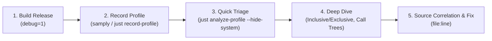

# Profiling & Performance Analysis (`analyze-profile`)

This skill provides a runbook and reference for recording and analyzing CPU execution profiles in Cranky.
Cranky profile dumps are captured as Firefox Profiler / samply-compatible `JSON.GZ` archives and analyzed using `just analyze-profile` (backed by [`scripts/analyze_profile.py`](file:///home/jao/code/cranky/scripts/analyze_profile.py)).

---

## 🚀 End-to-End Workflow



---

### Step 1: Build Release with Debug Symbols

Cranky's `[profile.release]` in [`Cargo.toml`](file:///home/jao/code/cranky/Cargo.toml) is configured with `debug = 1` to include line tables and function names without disabling compiler optimizations.

Always build release before profiling:
```bash
just release
# or: cargo build --release
```

---

### Step 2: Record a Profile

Profiles can be recorded either by launching Cranky directly or by attaching to an already-running process.

#### Option A: Launch and Record via Justfile
```bash
# Record until Cranky exits or Ctrl+C is pressed (saved to scripts/profile.json.gz)
just record-profile

# Record for a fixed duration (e.g., 10 seconds)
just record-profile -- -d 10

# Pass custom arguments to Cranky
just record-profile -- -d 15 -- -c config.toml
```

#### Option B: Attach to an Existing Cranky Process
```bash
# Attach to running Cranky instance for 10 seconds
samply record --save-only -o scripts/profile.json.gz -p $(pgrep cranky) -d 10
```

---

### Step 3: Triage & Initial Analysis

Run `just analyze-profile` to parse the profile, symbolize addresses via `llvm-symbolizer` / `addr2line`, and generate a markdown hotspot report.

```bash
# Filter out kernel/libc runtime frames to focus on application logic
just analyze-profile --hide-system
```

Key indicators to inspect during triage:
1. **Thread Overview:** Look at the CPU time and sample share across threads (e.g. main `cranky` thread, Tokio worker pools, DBus listeners).
2. **Top Hot Functions (Exclusive / Self Time):** Functions at the top of the list spend the most CPU cycles directly in their own function body.

---

### Step 4: Deep Dive Analysis

Depending on the nature of the performance issue, use specific flags to narrow down the bottleneck:

#### 1. Analyze Total Call-Tree Overhead (Inclusive Time)
When investigating high-level orchestration, layout passes, or reactive event cascades:
```bash
just analyze-profile --hide-system --sort-by inclusive
```

#### 2. Target Specific Worker Threads or Tokio Tasks
To analyze background worker threads or specific subsystem threads:
```bash
# Analyze all active threads
just analyze-profile --all-threads --hide-system

# Filter by thread name or TID
just analyze-profile --thread "tokio-runtime" --hide-system
```

#### 3. Inspect Inlined Frames and Call Trees
The report includes **Call Trees for Top Hotspots**:
- 🔺 **Top Callers (Ancestors):** Reveals which caller paths trigger the expensive operation.
- 🔻 **Top Callees (Children):** Shows what subroutines the hotspot spends time invoking.

#### 4. Export Machine-Readable JSON for Automated Verification
```bash
just analyze-profile --json > profile_summary.json
```

---

### Step 5: Source Code Correlation & Remediation

Use the file paths and line numbers (`file:line`) provided in the report table to inspect the hot code in `src/`.

Common Cranky performance patterns and fixes:

| Symptom | Likely Cause | Recommended Fix |
| :--- | :--- | :--- |
| **High `tiny-skia` / `cosmic-text` CPU** | Excessive redraws / rendering unchanged modules | Ensure modules debounce re-renders and only re-draw when their `SignalHub` state changes. |
| **High `taffy` / `lightningcss` time** | Recomputing CSS styles or full layout on every tick | Cache computed layout nodes and avoid reparsing stylesheets. |
| **Hot `zbus` / serialization** | Frequent polling over DBus or excessive object allocations | Throttle DBus message queries; subscribe to signals instead of polling. |
| **High `tokio::sync` / futex wait** | Lock contention on shared state | Replace coarse `RwLock`/`Mutex` with channel messages or atomic primitives. |
| **Excessive clone / heap allocations** | Deep copies in event loops | Use `Arc`, string slices (`&str`), or borrowed references where appropriate. |

---

## 🛠 Command Reference Cheat Sheet

| Command | Description |
| :--- | :--- |
| `just record-profile` | Record Cranky execution to `scripts/profile.json.gz` using samply |
| `just analyze-profile` | Analyze default profile (`scripts/profile.json.gz`) |
| `just analyze-profile path/to/profile.json.gz` | Analyze a specific profile dump |
| `just analyze-profile --hide-system` | Omit libc/kernel runtime frames for cleaner application report |
| `just analyze-profile --sort-by inclusive` | Sort by cumulative (inclusive) time down call stacks |
| `just analyze-profile --sort-by cpu` | Sort by estimated CPU time |
| `just analyze-profile --top 30` | Show top 30 hot functions (default: 20) |
| `just analyze-profile --all-threads` | Output reports for all active threads in the profile |
| `just analyze-profile -t <thread_name_or_tid>` | Filter analysis to a specific thread |
| `just analyze-profile --json` | Output full analysis data as structured JSON |
| `just analyze-profile -b target/release/cranky` | Specify binary explicitly for symbol resolution |
